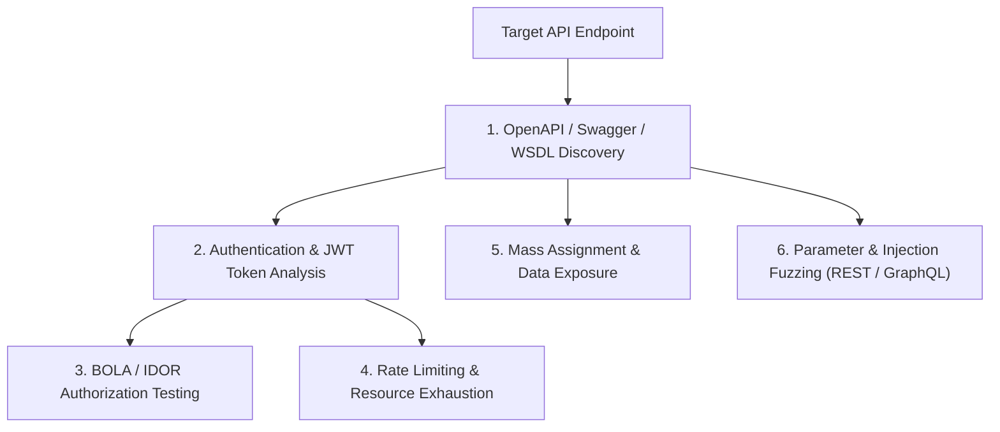

# API Security & Endpoint Auditing Cheat Sheet

A comprehensive reference guide for security testing REST, GraphQL, and OAuth 2.0 application programming interfaces (APIs), covering OWASP API Security Top 10 vulnerabilities.

> [!NOTE]
> All API audits and parameter tests must be executed strictly within authorized testing environments and target scopes.

---

## API Security Assessment Flowchart



---

## 1. OpenAPI & Swagger Schema Discovery

Locating raw API documentation schemas exposes hidden endpoints, data models, and parameters.

```text
# Common Swagger / OpenAPI Endpoints to Probe
/swagger-ui.html
/v1/swagger.json
/v2/api-docs
/openapi.json
/api/v1/docs
/graphql
```

### Automated Schema Brute-forcing with Kiterunner
```bash
# Scan target endpoint for hidden API routes using Kiterunner wordlists
kr scan https://api.target.com -w routes-large.kite -x 20
```

---

## 2. OWASP API Security Top 10 Checklist

### API1: Broken Object Level Authorization (BOLA / IDOR)
* **Test Vector:** Change target resource ID in URI from caller's ID to victim's ID.
* **Request:** `GET /api/v1/users/9942/profile` $\rightarrow$ Change to `GET /api/v1/users/9943/profile`
* **Remediation:** Enforce object-level access verification against the session identifier on the backend server.

### API2: Broken Authentication
* **Test Vector:** Test for missing token expiry, weak secret keys, credential stuffing vulnerabilities, or algorithm downgrade flaws (`alg: none`).

### API3: Broken Object Property Level Authorization (Mass Assignment)
* **Test Vector:** Inject unexpected administrative properties into HTTP JSON request bodies during user registration or profile updates.
```json
// POST /api/v1/user/update
{
  "name": "Jane Doe",
  "email": "jane@example.com",
  "is_admin": true,       // Injected Property
  "role": "administrator" // Injected Property
}
```

### API4: Unrestricted Resource Consumption (Rate Limiting)
* **Test Vector:** Send high-frequency requests without rate limiting headers to test CPU/database resource limits.
```bash
# Test for missing rate-limits using ffuf
ffuf -u https://api.target.com/v1/reset-password -X POST -d "email=victim@target.com" -p 0.1 -c -w numbers.txt
```

---

## 3. GraphQL Security Auditing

GraphQL endpoints often consolidate multiple queries into a single HTTP POST request.

### Introspection Query (Map Schema)
```json
// POST /graphql
{
  "query": "{ __schema { types { name fields { name type { name kind ofType { name } } } } } }"
}
```

### Batching & Nesting Denial of Service
```json
// Circular / Deeply Nested Query Attack
{
  user {
    friends {
      friends {
        friends {
          name
        }
      }
    }
  }
}
```

---

## API Vulnerability Remediation Summary

| Risk Category | Vulnerability Mechanism | Defensive Control |
| :--- | :--- | :--- |
| **BOLA** | Trusting user-supplied resource IDs | Mandatory session-based ownership checks |
| **Mass Assignment** | Binding DTO objects directly to database models | Whitelisting allowed input fields explicitly |
| **GraphQL Introspection** | Exposing full schema metadata in production | Disable introspection queries in live deployment |
| **Rate Limiting** | Missing request count thresholds per IP/Token | Implement API Gateway throttling & CAPTCHA protection |
