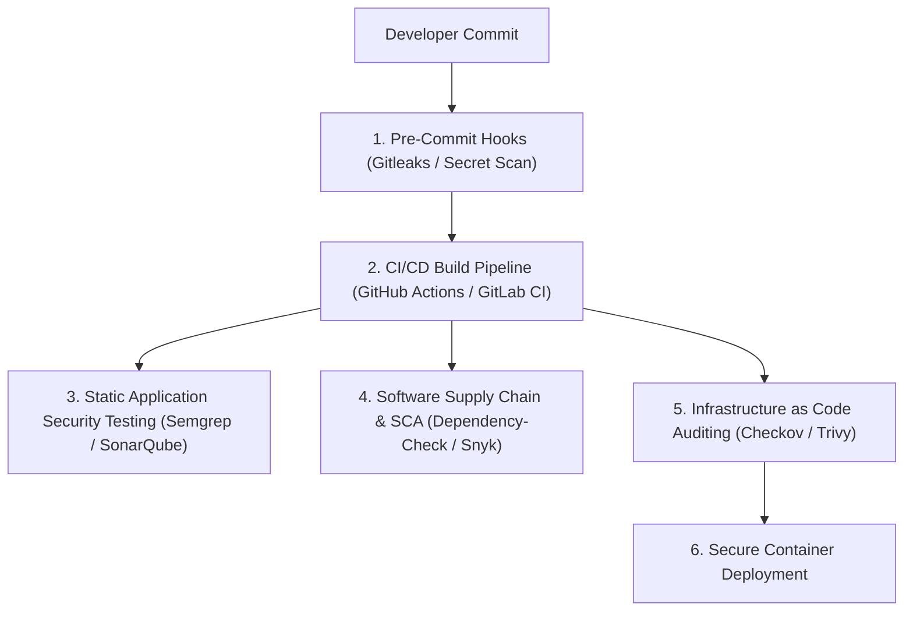

# DevSecOps, Secrets Scanning & IaC Security Cheat Sheet

A comprehensive reference guide for embedding security into CI/CD pipelines, scanning git repositories for leaked secrets, auditing Infrastructure as Code (IaC), and enforcing pre-commit hooks.

> [!NOTE]
> All DevSecOps practices are designed to shift security left, enabling developers and DevOps engineers to detect vulnerabilities early in the software development lifecycle (SDLC).

---

## CI/CD Security Pipeline Flowchart



---

## 1. Secrets Detection with Gitleaks

Prevent hardcoded API keys, RSA private keys, AWS access tokens, and passwords from entering git history.

### Basic CLI Commands
```bash
# Scan local repository directory for hardcoded secrets
gitleaks detect --source . --verbose

# Scan git commit history log
gitleaks detect --log-opts="--all" --report-path secrets-report.json

# Protect against uncommitted secrets in staging area
gitleaks protect --staged
```

### `.gitleaks.toml` Custom Rule Configuration
```toml
title = "Custom Secret Detection Rules"

[[rules]]
id = "custom-api-key"
description = "Detects hardcoded Company API Keys"
regex = '''(?i)(company_api_key|app_secret)\s*[:=]\s*['"][a-zA-Z0-9]{32}['"]'''
tags = ["key", "secret"]
```

---

## 2. Infrastructure as Code (IaC) Auditing with Checkov

Audit Terraform, CloudFormation, Kubernetes YAML, and Dockerfiles for misconfigurations before deployment.

```bash
# Scan Terraform directory for security policy violations
checkov -d ./terraform/ --framework terraform

# Scan Kubernetes deployment manifests and show failing policies only
checkov -d ./k8s/ --framework kubernetes --compact

# Output scan results in SARIF format for GitHub Security integration
checkov -d . -o sarif --output-file-path results.sarif
```

---

## 3. Pre-Commit Hook Integration

Automatically trigger security checks before allowing `git commit` to execute locally.

### Config file `.pre-commit-config.yaml`
```yaml
repos:
  - repo: https://github.com/gitleaks/gitleaks
    rev: v8.18.0
    hooks:
      - id: gitleaks
  - repo: https://github.com/bridgecrewio/checkov
    rev: 3.2.0
    hooks:
      - id: checkov
        args: [-d, .]
```

```bash
# Install pre-commit framework and register git hooks
pip install pre-commit
pre-commit install
```

---

## DevSecOps Scanner Comparison Matrix

| Security Domain | Tool | Primary Audit Target | Pipeline Stage |
| :--- | :--- | :--- | :--- |
| **Secrets Scanning** | **Gitleaks** | Git commits, API tokens, Private keys | Pre-commit / Pull Request |
| **IaC Security** | **Checkov** | Terraform, CloudFormation, Helm charts | Pre-build / Pull Request |
| **SCA / Supply Chain** | **Trivy / Snyk** | `package.json`, `pom.xml`, Docker images | Build / Packaging |
| **SAST Code Audit** | **Semgrep** | Python, Go, Java, JS source code | Post-merge / Build |
