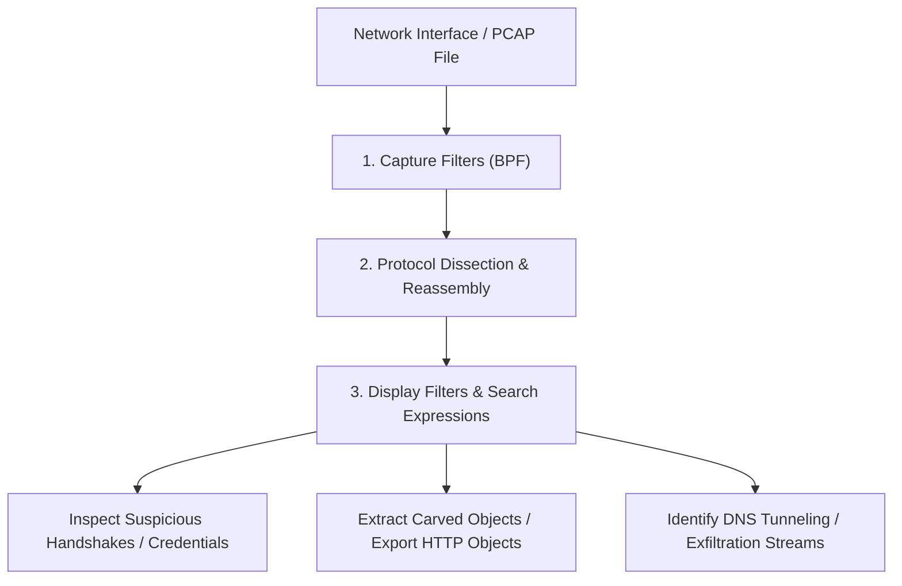

# Wireshark & Network Packet Analysis Cheat Sheet

A comprehensive reference guide for network traffic inspection, Wireshark display & capture filters, PCAP forensics, protocol analysis, and detecting suspicious network activity.

> [!NOTE]
> All packet capture and inspection techniques are intended for network troubleshooting, security auditing, and authorized SOC threat hunting.

---

## Network Packet Inspection Workflow



---

## 1. Wireshark Capture Filters (Berkeley Packet Filter - BPF)

Capture filters reduce CPU load and disk usage by discarding unwanted traffic *before* it is recorded.

```text
# Filter by Host IP
host 192.168.1.100
src host 10.0.0.5
dst host 172.16.0.1

# Filter by Port or Port Range
port 80
port 443 or port 8080
portrange 20-25

# Combine Logic Operators
host 192.168.1.50 and port 80
not arp and not icmp
```

---

## 2. Essential Display Filters for Threat Hunting

Display filters do not alter captured data; they allow pinpointing specific packets within a PCAP stream.

### HTTP & Web Application Filters
```text
# Find all HTTP GET and POST requests
http.request.method == "GET" || http.request.method == "POST"

# Filter by HTTP Response Status Codes (e.g., Unauthorized / Internal Server Error)
http.response.code == 401 || http.response.code == 500

# Search for specific user-agents (e.g., python-requests, sqlmap, curl)
http.user_agent contains "sqlmap" || http.user_agent contains "Python"

# Find web server authorization headers containing basic credentials
http.authorization
```

### DNS Analysis & Tunneling Detection
```text
# Filter all DNS queries
dns.flags.response == 0

# Find unusually long query names (potential DNS data exfiltration/tunneling)
dns.qry.name.len > 30

# Filter for specific domain lookups
dns.qry.name contains "malicious-domain.com"
```

### TCP/IP & Suspicious Flag Inspection
```text
# Find TCP SYN Flood scans (SYN flag set, ACK not set)
tcp.flags.syn == 1 and tcp.flags.ack == 0

# Find TCP Reset packets (broken connection / port closed response)
tcp.flags.reset == 1

# Filter for a specific TCP stream conversation
tcp.stream eq 4
```

---

## 3. Advanced Packet Forensics Techniques

### 1. Following TCP/UDP Streams
* **Action:** Right-click any HTTP, TCP, or UDP packet $\rightarrow$ **Follow** $\rightarrow$ **TCP Stream**.
* **Use Case:** Reconstructs the complete plaintext conversation between client and server (e.g., telnet session, raw HTTP payload, or unencrypted shell session).

### 2. Exporting Objects & Files from PCAP
* **Action:** Go to **File** $\rightarrow$ **Export Objects** $\rightarrow$ **HTTP / SMB / TFTP**.
* **Use Case:** Carves transmitted files (e.g., uploaded web shells, downloaded executables, images, or documents) directly out of network packets.

---

## Wireshark Analysis Quick Matrix

| Analysis Objective | Wireshark Display Filter | Primary Security Purpose |
| :--- | :--- | :--- |
| **Plaintext Credentials** | `http.authbasic || pop || imap || ftp` | Locating unencrypted passwords in transit |
| **Port Scanning Activity** | `tcp.flags.syn==1 && tcp.flags.ack==0` | Identifying rapid SYN port scanning sweeps |
| **SSL/TLS Handshakes** | `tls.handshake.type == 1` | Inspecting SNI (Server Name Indication) domain headers |
| **ARP Spoofing Detection** | `arp.duplicate-address-frame` | Detecting Man-in-the-Middle (MitM) ARP poisoning |
