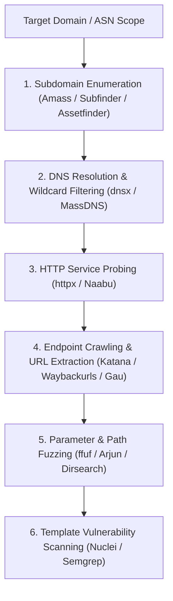

# Modern Bug Bounty & Penetration Testing Reconnaissance Pipeline

A structured, end-to-end methodology for asset discovery, attack surface mapping, endpoint crawling, and automated vulnerability scanning.

> [!NOTE]
> This guide is intended for authorized security audits, bug bounty programs, and defensive attack surface management. Ensure all target domains are strictly within your scope of authorization.

---

## 1. Automated Reconnaissance Pipeline Overview



---

## 2. Step-by-Step Reconnaissance Workflow

### Phase 1: Passive & Active Subdomain Enumeration
Combine passive intelligence aggregators with DNS brute-forcing to discover all public subdomains.

```bash
# 1. Passive Subdomain Discovery with Subfinder
subfinder -d target.com -all -silent -o subdomains_passive.txt

# 2. In-Depth DNS Enumeration with Amass
amass enum -passive -d target.com -o subdomains_amass.txt

# 3. Combine and Deduplicate Discovered Domains
cat subdomains_passive.txt subdomains_amass.txt | sort -u > all_subdomains.txt
```

---

### Phase 2: DNS Resolution & Active Probing
Verify which discovered domains resolve to active IP addresses and identify open HTTP web services.

```bash
# 1. Resolve IPs and filter out wildcard responses with dnsx
dnsx -l all_subdomains.txt -resp-ip -a -aaaa -cname -silent -o resolved_hosts.txt

# 2. Probe for live web services across common web ports (80, 443, 8000, 8080, 8443)
cat resolved_hosts.txt | httpx -title -tech-detect -status-code -follow-redirects -silent -o live_web_targets.txt
```

---

### Phase 3: Historic URL Mining & Live Crawling
Extract historical endpoints, parameter names, and JavaScript files from web archives and active spiders.

```bash
# 1. Mining Historic Endpoints from Wayback Machine & AlienVault OTX
waybackurls target.com | sort -u > wayback_urls.txt

# 2. Active Web Crawling with Katana
katana -u live_web_targets.txt -jc -kf -d 3 -silent -o katana_endpoints.txt

# 3. Extract JavaScript file URLs for sensitive credential analysis
cat katana_endpoints.txt wayback_urls.txt | grep -E "\.js(\?|$)" | sort -u > js_files.txt
```

---

### Phase 4: Endpoint Fuzzing & Parameter Discovery
Identify hidden administrative directories, backup files, and query parameters.

```bash
# 1. Fuzzing Hidden Directories & Files using ffuf
ffuf -w wordlists/common_paths.txt -u https://target.com/FUZZ -mc 200,301,302,403 -sf

# 2. Discover Hidden Query Parameters using Arjun
arjun -u https://target.com/api/v1/user -m GET,POST --stable
```

---

### Phase 5: Automated Vulnerability Scanning
Run fast, community-curated vulnerability templates against validated live HTTP targets.

```bash
# Run Nuclei against all live web targets for high/critical security flaws
nuclei -l live_web_targets.txt -severity critical,high -es info -o nuclei_results.txt
```

---

## 3. Best Practices & Rate Limiting Guidelines

> [!TIP]
> * **Respect Rate Limits:** Always use `-rate-limit` or `-c` flags to prevent crashing target DNS servers or triggering automatic WAF IP blocks.
> * **Filter Noise:** Exclude standard static assets (`.png`, `.jpg`, `.css`, `.woff`) to focus analysis on API endpoints and dynamic scripts.
> * **Log Output:** Store execution outputs in dedicated, dated target directories for reproducibility and reporting.
