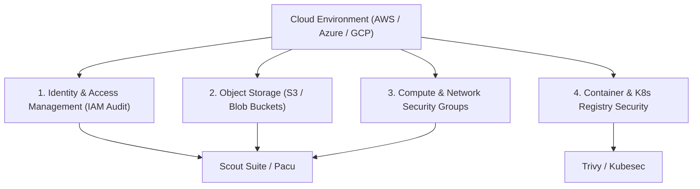

# Cloud & Container Security Assessment Guide

A practical guide for auditing Amazon Web Services (AWS), Microsoft Azure, Google Cloud Platform (GCP), Docker containers, and Kubernetes cluster configurations.

> [!NOTE]
> All auditing workflows should be executed using dedicated assessment credentials with read-only / Security Audit privileges unless authorized for active penetration testing.

---

## Cloud Audit Architecture Overview



---

## 1. AWS IAM & Storage Assessment

### Auditing S3 Bucket Permissions
```bash
# List all public S3 buckets using AWS CLI
aws s3api list-buckets --query "Buckets[].Name" --output text

# Check ACL of a specific bucket for Public-Read access
aws s3api get-bucket-acl --bucket target-company-data
```

### IAM Privilege Escalation Checks with Pacu
```bash
# Start Pacu AWS Exploitation Framework
pacu

# Import assessment credentials
set_keys

# Run automated IAM privilege escalation scan
run iam__enum_permissions
run iam__privesc_scan
```

---

## 2. Multi-Cloud Security Auditing with Scout Suite

Scout Suite aggregates configuration data from cloud APIs to highlight misconfigurations and compliance violations.

```bash
# Run multi-cloud security scan against AWS
scout aws --profile SecurityAuditProfile

# Run scan against Microsoft Azure environment
scout azure --cli

# Run scan against Google Cloud Platform (GCP)
scout gcp --user-account
```

---

## 3. Container & Kubernetes Vulnerability Scanning

### Container Image Scanning with Trivy
```bash
# Scan a local or remote Docker image for OS and package vulnerabilities
trivy image --severity HIGH,CRITICAL targetapp:latest

# Scan Infrastructure as Code (IaC) Terraform / CloudFormation files
trivy config ./infrastructure/
```

### Kubernetes Manifest Analysis with Kubesec
```bash
# Evaluate Kubernetes deployment YAML for privilege escalation risks
kubesec scan deployment.yaml
```

---

## Cloud Security Hardening Matrix

| Security Domain | Risk Vector | Mitigation Strategy |
| :--- | :--- | :--- |
| **IAM** | Over-privileged service accounts & stale API keys | Enforce Least Privilege, require MFA, rotate access keys every 90 days |
| **Storage** | Publicly accessible S3 buckets / Blob containers | Enable S3 Block Public Access at the account level & enforce KMS encryption |
| **Network** | Security groups allowing 0.0.0.0/0 on SSH (22) / RDP (3389) | Restrict administrative access to Bastion hosts / VPN IP ranges |
| **Kubernetes** | Containers running as root with `privileged: true` | Enforce Pod Security Standards (PSS) & SecurityContext non-root users |
