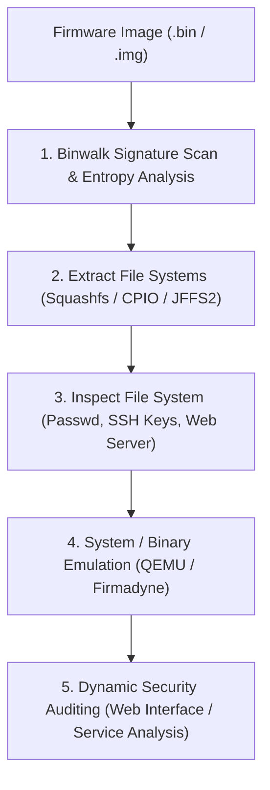

# Firmware Analysis & IoT Security Starter Guide

A practical guide for hardware security researchers, IoT auditors, and reverse engineers, covering firmware image extraction using Binwalk, filesystem mounting, QEMU architecture emulation, and static analysis.

> [!NOTE]
> Designed for auditing smart devices, router firmware, embedded Linux controllers, and IoT hardware within authorized security assessments.

---

## Embedded Firmware Analysis Architecture



---

## 1. Firmware Signature Extraction with Binwalk

Binwalk scans binary files for known magic headers (Squashfs, CramFS, LZMA, gzip, U-Boot bootloader).

```bash
# 1. Scan firmware file to display identified signatures and byte offsets
binwalk router_firmware.bin

# 2. Analyze entropy to determine if firmware sections are compressed or encrypted
binwalk -E router_firmware.bin

# 3. Extract embedded filesystems automatically (-e = extract, -M = recursive)
binwalk -e -M router_firmware.bin
```

---

## 2. Inspecting Extracted Embedded File Systems

Once Binwalk extracts the root filesystem (typically `_router_firmware.bin.extracted/squashfs-root`), inspect it for common vulnerabilities:

### High-Priority Audit Locations
```bash
# 1. Check for hardcoded credentials / password hashes
cat squashfs-root/etc/shadow
cat squashfs-root/etc/passwd

# 2. Search for hardcoded RSA private keys and SSL certificates
find squashfs-root/ -name "*.pem" -o -name "*.key" -o -name "*.crt"

# 3. Inspect web server binary configurations (e.g., lighttpd, boa, mini_httpd)
cat squashfs-root/etc/lighttpd/lighttpd.conf

# 4. Search for hardcoded secret tokens in shell scripts
grep -rnw 'squashfs-root/www/' -e 'password' -e 'admin' -e 'secret'
```

---

## 3. Emulating ARM/MIPS Firmware with QEMU

When physical hardware is unavailable, QEMU allows emulating non-x86 CPU architectures (MIPS, ARM) locally.

```bash
# 1. Install QEMU user and system emulation tools
sudo apt update && sudo apt install qemu-user-static qemu-system-mips qemu-system-arm

# 2. Copy static QEMU binary into extracted rootfs
cp /usr/bin/qemu-mips-static squashfs-root/usr/bin/

# 3. Chroot into target filesystem and execute embedded binary
sudo chroot squashfs-root /usr/bin/qemu-mips-static /bin/busybox
```

---

## IoT Security Audit Checklist

| Audit Category | Common Vulnerability | Remediation / Defense |
| :--- | :--- | :--- |
| **Authentication** | Hardcoded root credentials or telnet backdoor accounts | Enforce unique, randomly generated per-device passwords |
| **Transport Security** | Unencrypted HTTP / Telnet management interfaces | Disable plaintext protocols; enforce TLS/HTTPS & SSH |
| **Firmware Integrity** | Missing digital signature verification on OTA updates | Implement cryptographic bootloader verification (Secure Boot) |
| **Services** | Exposed debugging ports (UART, JTAG, UPnP) | Disable physical debug interfaces in production hardware builds |
