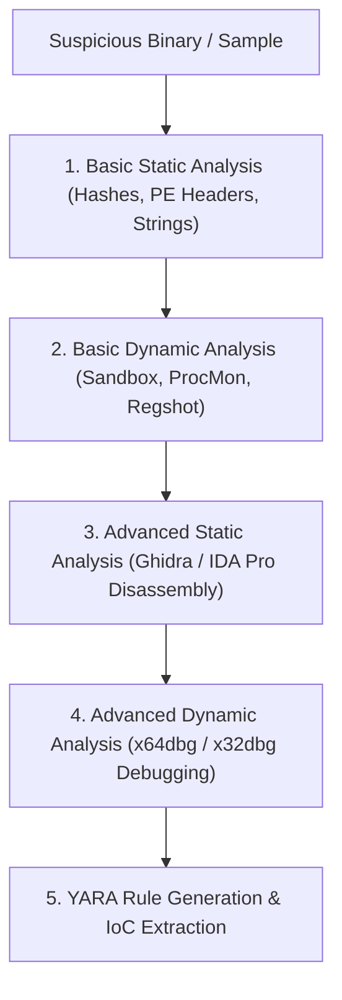

# Malware Analysis & Reverse Engineering Starter Guide

A foundational guide for reverse engineers, threat analysts, and malware researchers, covering static analysis, dynamic behavioral monitoring, disassembly, and writing YARA rules.

> [!WARNING]
> **Safety Notice:** Always execute malware analysis inside an isolated, non-networked Virtual Machine sandbox (e.g., FLARE VM, REMnux) with host isolation enabled.

---

## Malware Analysis Workflow Architecture



---

## 1. Basic Static Analysis

Static analysis inspects binary file attributes without executing the code.

### File Identification & Hashing
```bash
# Calculate SHA-256 hash for VirusTotal lookup
sha256sum sample.exe

# Extract human-readable ASCII and Unicode strings
strings -n 8 sample.exe | grep -iE "http|https|cmd\.exe|powershell|reg"
```

### Inspecting PE Headers with PEstudio / Capa
* **PE Sections:** Look for unusual non-standard section names or high entropy in `.text` / `.data` sections (indicates packed or encrypted code).
* **Imported Functions (IAT):**
  * `VirtualAlloc` / `WriteProcessMemory` / `CreateRemoteThread` $\rightarrow$ Process Injection indicator.
  * `InternetOpenA` / `HttpSendRequestA` $\rightarrow$ Network C2 indicator.
  * `RegSetValueExA` / `RegCreateKeyExA` $\rightarrow$ Persistence indicator.

---

## 2. Basic Dynamic Analysis

Dynamic analysis records behavioral changes during runtime execution.

### Recommended Lab Monitoring Tools
1. **Process Monitor (ProcMon):** Captures real-time file system, registry, and process/thread activity.
2. **Process Explorer:** Visualizes process hierarchies, active DLL handles, and network connections.
3. **Regshot:** Compares registry snapshots before and after sample execution to identify persistent registry modifications.
4. **Wireshark / INetSim:** Captures simulated or active DNS lookups and HTTP beacon traffic.

---

## 3. Disassembly & Decompilation with Ghidra

Ghidra (NSA open-source suite) decompiles machine code into C-like pseudocode.

### Disassembly Checklist
1. **Locate `main` / `WinMain` Entry Point:** Trace execution flow from binary start.
2. **Decompile Suspicious Functions:** Convert assembly (`mov`, `push`, `call`) into readable C code.
3. **Identify Anti-Analysis Checks:** Look for `IsDebuggerPresent()` or `rdtsc` timing loops used to defeat sandbox environments.

---

## 4. Writing YARA Rules for Malware Detection

YARA allows analysts to classify malware samples based on textual or binary patterns.

```yara
rule Detect_Suspicious_Downloader {
    meta:
        description = "Detects basic HTTP downloader sample"
        author = "Security Researcher"
        date = "2026-09-07"
        severity = "High"

    strings:
        $user_agent = "Mozilla/5.0 (Windows NT 10.0; Win64; x64)" ascii
        $win_api1   = "InternetOpenUrlA" ascii
        $win_api2   = "URLDownloadToFileA" ascii
        $cmd_exec   = "cmd.exe /c start" ascii

    condition:
        uint16(0) == 0x5D4D and // MZ Magic Header check (Windows PE)
        ($user_agent and 2 of ($win_api1, $win_api2, $cmd_exec))
}
```

---

## Static vs Dynamic Analysis Comparison

| Feature | Basic Static Analysis | Basic Dynamic Analysis |
| :--- | :--- | :--- |
| **Execution Risk** | Zero (Binary is never executed) | High (Requires isolated sandbox) |
| **Speed** | Extremely fast (Seconds to minutes) | Medium (Requires sandbox run time) |
| **Bypass Vectors** | Fooled by packers / obfuscators | Fooled by anti-VM / anti-sandbox logic |
| **Key Output** | Hashes, PE imports, static strings | Network C2 IPs, registry drops, process trees |
