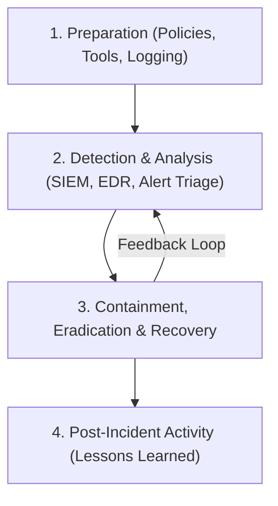

# SOC Incident Response & Threat Hunting Playbook

A structured playbook for Security Operations Center (SOC) analysts, incident responders, and Blue Teams, covering Windows Event ID triage, Sysmon event logging, Volatility memory forensics, and containment strategies.

> [!NOTE]
> Designed in accordance with NIST SP 800-61 Rev. 2 (Computer Security Incident Handling Guide) and the MITRE ATT&CK Framework.

---

## NIST Incident Response Life Cycle



---

## 1. Critical Windows Security Event IDs for Triage

Security Information and Event Management (SIEM) platforms rely on specific Event IDs to detect lateral movement, privilege escalation, and persistence.

### Authentication & Account Usage
* **Event ID 4624:** Successful Logon (Check Logon Type: Type 2 = Interactive, Type 3 = Network, Type 10 = Remote Desktop / RDP).
* **Event ID 4625:** Failed Logon attempt (Useful for brute-force and password-spraying detection).
* **Event ID 4672:** Special Privileges Assigned to New Logon (Indicates Administrator access).

### Process Creation & Execution
* **Event ID 4688:** A new process has been created (Requires enabling Process Creation auditing and Command Line logging).
* **Event ID 7045:** A service was installed in the system (Common persistence vector).

---

## 2. Sysmon (System Monitor) Threat Detection Rules

Microsoft Sysmon enriches standard Windows logs with deep system event metrics.

### Key Sysmon Event IDs
* **Event ID 1:** Process Creation (Includes full command-line arguments and process parent hashes).
* **Event ID 3:** Network Connection (Correlates initiating process to destination IP/Port).
* **Event ID 8:** CreateRemoteThread (Detects process injection attacks into system processes like `lsass.exe` or `explorer.exe`).
* **Event ID 11:** File Create (Monitors file drops in `\AppData\Local\Temp` or `C:\Windows\Tasks`).

```xml
<!-- Example Sysmon Config Rule: Detect LSASS Process Access (Credential Dumping) -->
<Sysmon configversion="4.50">
  <EventFiltering>
    <ProcessAccess onmatch="include">
      <TargetImage condition="end with">lsass.exe</TargetImage>
    </ProcessAccess>
  </EventFiltering>
</Sysmon>
```

---

## 3. Volatility 3 RAM Memory Forensics Workflow

When an active compromise occurs, volatile RAM memory captures unencrypted processes, network sockets, and injected code.

```bash
# 1. Identify Process List from Memory Image
vol -f memory.vmem windows.pslist

# 2. Check for Hidden or Unlinked Processes (Detect Rootkits)
vol -f memory.vmem windows.psscan

# 3. List Active Network Sockets & Remote IP Connections
vol -f memory.vmem windows.netscan

# 4. Dump Injected Code or Suspicious Memory Sections
vol -f memory.vmem windows.malfind -o ./output/

# 5. Extract Command Prompt (cmd.exe) History
vol -f memory.vmem windows.cmdline
```

---

## 4. Containment & Remediation Checklist

> [!IMPORTANT]
> **Immediate Isolation Actions:**
> 1. **Network Isolation:** Quarantine host via EDR agent or disable network interface card (NIC).
> 2. **Credential Invalidation:** Revoke compromise user sessions, reset passwords, and terminate OAuth/JWT refresh tokens.
> 3. **Process Termination:** Kill malicious process IDs (PIDs) identified in SIEM/EDR logs.
> 4. **Preserve Forensics:** Acquire disk image and RAM capture *before* rebooting or wiping the system.
